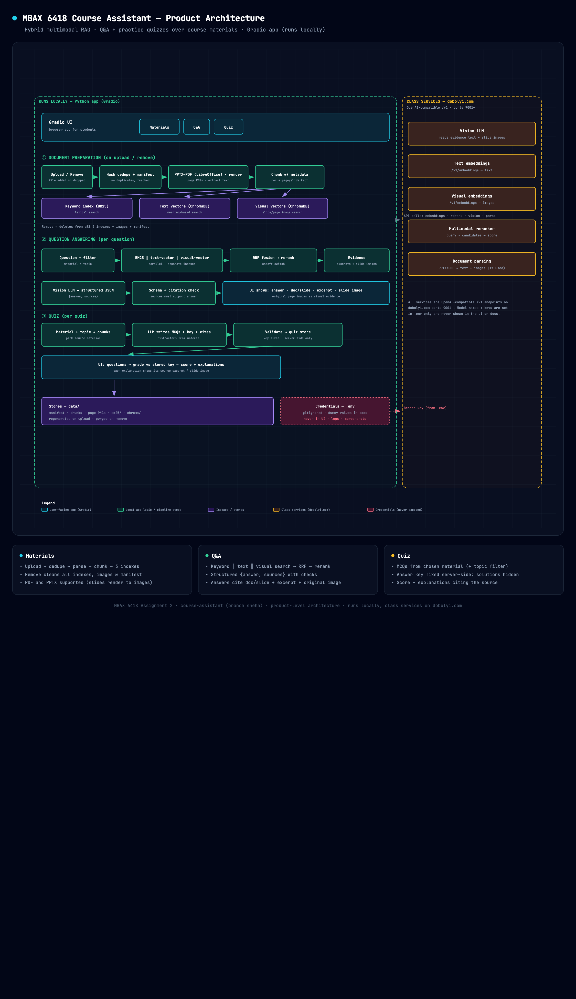

# course-assistant

MBAX 6418: Business Generative AI and LLM Course Assistant

A hybrid multimodal RAG app that answers questions from course materials
(slides, syllabus, quizzes, guides) and generates practice quizzes — built
with Python (bm25s, ChromaDB, LangChain-style chunking, Gradio) and the class
services on `dobolyi.com:9001+`.

> Detailed setup, usage, findings, and limitations follow below (in progress).
> See `PROGRESS.md` for the step-by-step build log.

## Architecture

The app runs locally: the **Materials** tab ingests PDF/PPTX (dedupe → parse →
render page/slide images → chunk → BM25 + text-vector + visual-vector
indexes), the **Q&A** tab retrieves evidence across all three indexes, fuses
with RRF, optionally reranks, and answers with a vision LLM as structured
`{answer, sources}` (validated), and the **Quiz** tab generates MCQs with a
fixed server-side answer key, scores, and source-cited explanations.

Interactive version: `docs/architecture.html` (opens in any browser).
