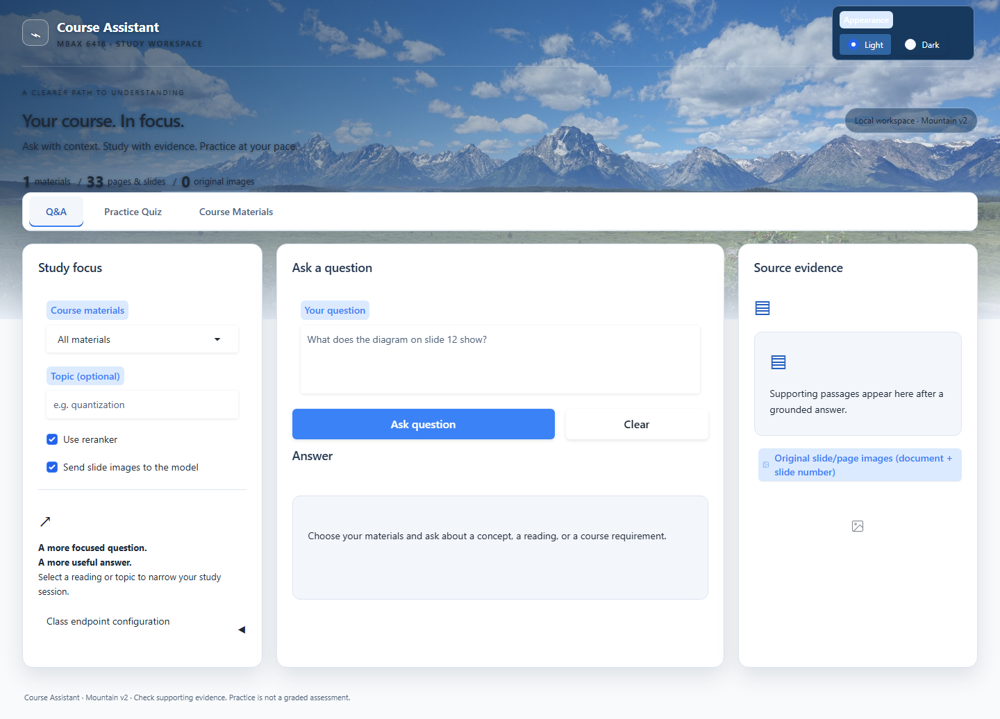
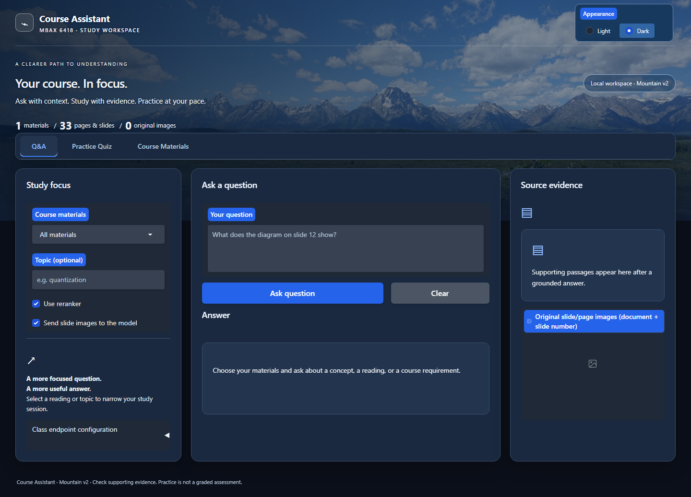

# course-assistant

MBAX 6418: Business Generative AI and LLM Course Assistant

A generic, app-managed hybrid multimodal RAG app: students upload **their
own** course materials (PDF/PPTX), ask grounded questions with visual
evidence, and generate practice quizzes — built with Python (bm25s, ChromaDB,
Gradio) and the class services on `dobolyi.com:9001+`. No course file is
hardcoded anywhere; the corpus is whatever the user adds in the app.

> Detailed setup, usage, findings, and limitations follow below (in progress).
> See `PROGRESS.md` for the step-by-step build log.

## Default interface: Mountain Master

**Mountain Master is the main interface on the Meaghan branch**, combining the mountain dashboard design with the course backend. It includes **Q&A**, **Practice Quiz**, **Course Materials**, and a persistent **Light / Dark** appearance control. The interface displays the design label **Mountain v2**.

### Open on Windows

Download `Start Course Assistant.bat` from this page, place it in the `course-assistant` folder, then double-click it. It installs dependencies and opens the dashboard in your browser. Keep the window open while using the app.

For detailed dashboard instructions, see [README-DASHBOARD.md](README-DASHBOARD.md).

### Preview

**Light mode**



**Dark mode**



### Manual setup (macOS/Linux)

```bash
uv venv --python 3.11 .venv
uv pip install --python .venv/bin/python -r requirements-dashboard.txt
cp .env.example .env          # only if .env does not already exist; configure locally
.venv/bin/python -m src.app   # opens the default Mountain interface
```

On Windows, use `.venv\Scripts\python.exe` instead of `.venv/bin/python`. All launch methods use `src.app`; the older standalone dashboard modules are not alternate entry points.

**Materials management (works with zero configuration):** in the app's
Materials tab, upload PDF/PPTX files. The same file uploaded twice is a no-op
(content-hash dedupe); removing a document purges its text, images, and index
entries. PPTX files are converted with LibreOffice (install:
`brew install --cask libreoffice`; without it, export the deck to PDF and
upload that). See `data/library/README.md` for formats and conversion steps.

**Q&A and Quiz tabs activate once `.env` has the class endpoints** (vision
chat LLM, text/visual embeddings, multimodal reranker — `dobolyi.com:9001+`).
Until then the app clearly reports which services are missing.

## Architecture


The app runs locally: the **Materials** tab ingests uploaded PDF/PPTX (dedupe
→ parse → render page/slide images → chunk → BM25 + text-vector +
visual-vector indexes), the **Q&A** tab retrieves evidence across the three
indexes (keyword always; vectors when configured), fuses with RRF, optionally
reranks, and answers with a vision LLM as structured `{answer, sources}`
(schema- and support-validated), showing the original slide images with
document + slide number; the **Quiz** tab generates MCQs from the selected
uploaded material with a fixed server-side answer key, scores, and
source-cited explanations. Interactive diagram: `docs/architecture.html`.

## Credentials

Real keys live only in the local, gitignored `.env` (dummy values in
`.env.example`). They are never shown in the UI, logs, errors, screenshots,
docs, or on GitHub.

---

## Grounded QA — evaluation findings (Savannah's task, 2026-10-08)

**What was tested:** the Q&A pipeline on a real corpus (Week 2 deck — 42
slides, Week 6 deck — 20 slides, Syllabus — 7 pages; all with rendered slide
images) against the live class services (chat `9001`, text embeddings `9002`,
reranker `9004`; visual embeddings `9003` was down during the run). A fixed
10-question set was answered at **temperature 0**, evidence budget 8
(`TOP_K_FINAL=8`), and every response was validated for schema + source
support. Full results: `outputs/findings/grounded_qa_eval_live_k8_20261008.json`.

| # | Question | Outcome | Source / note |
|---|---|---|---|
| 1 | What is quantization? | ✅ grounded | Week 2 p15–16, 5.4 s |
| 2 | What does fine-tuning do to a model's weights? | ⚠️ honest refusal | false negative (materials likely cover it) |
| 3 | Context window & why it matters for RAG | ❌ invalid | model output truncated mid-JSON; passed on rerun (flake, not systemic) |
| 4 | Launching a Gradio app for others | ⚠️ honest refusal | correctly outside this corpus |
| 5 | Quantization vs fine-tuning comparison | ✅ grounded | Week 2 p15, 20 s |
| 6 | Main components of RAG | ⚠️ honest refusal | correctly outside this corpus |
| 7 | **Vibe Coding "Prod" meme** | ✅ grounded (vision) | identified from the actual slide image, Week 2 p33 |
| 8 | RAG pipeline diagram | ⚠️ honest refusal | correctly outside this corpus |
| 9 | Capital of France | ✅ honest refusal | correct "not in materials" behavior |
| 10 | How was this assistant built? | ⚠️ honest refusal | correctly outside this corpus |

**Summary: 9/10 schema+support valid; 3 grounded answers with verifiable
sources; 6 honest refusals (5 correct, 1 false negative); vision path sent
slide images on 9/10 questions.** The one failure was an output-truncation
flake (the model started a correct answer but got cut off mid-JSON) — the
fallback ladder ran, and the same question passed on the rerun. Since the
run, `parse_json_response` gained truncation repair and the vision rung
sends a larger output budget, so this class of failure is mitigated.

**Design comparison (rerank ON vs OFF):** the same 10 questions, same
temperature, on the same corpus. Both configurations scored **10/10 valid**;
rerank ON averaged **8.9 s/question** vs **6.96 s offline**. Reranking did
not change correctness at this corpus size, but it re-orders low-quality
candidates ahead of better ones in larger libraries and costs under 2 s on
average — recommendation: **keep reranking ON**. Full per-question record:
`outputs/findings/grounded_qa_compare_rerank_latest.json`.

**Honest limitations:** the visual-embedding endpoint (9003) was unreachable
throughout the run, so the visual-*vector* retrieval leg is untested live
(the meme/diagram evidence came from text retrieval + slide images sent to
the vision model). One false negative (fine-tuning). Corpus here is 3 real
documents; results should be re-checked as the library grows. To reproduce:
`.env` with class endpoints, `python -m src.library add <files>`, then
`TOP_K_FINAL=8 python -m src.eval_qa` and
`TOP_K_FINAL=8 python -m src.eval_qa --compare-rerank`. Test suite: **94
passed, 4 skipped**.
